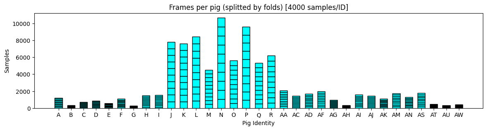

# FaroPigSeg & FaroPigReID-33: Datasets for Pig Segmentation and Reidentification

FaroPigSeg & FaroPigReID-33 are public datasets for pig segmentation and reidentification introduced in the paper [Housed Pig Identification and Tracking for Precision Livestock Farming](https://web.ub.edu/en/home).

The datasets were created with the support of the University of Barcelona and AGCO Corporation, and all the images were collected in a commercial pig finishing farm. The right to collect data and make datasets public has been granted by the company and the farmers.

**Note**: Both of the datasets are fully uploaded on Kaggle. Here on GitHub we only keep several sample for demonstrating the dataset structure. For full datasets, please go to [FaroPigSeg](https://www.kaggle.com/datasets/yudongyan/faropigseg) and [FaroPigReID-33](https://www.kaggle.com/datasets/yudongyan/faropigreid-33). 

## FaroPigSeg

The dataset FaroPigSeg is created for the instance segmentation task introduced in the paper. It contains 1518 annotated pig images, and more than 16,000 pig instances were labeled in total. The images were collected from different pens of the farm, and the labels are in the YOLO format.

### Dataset Structure

All images and their corresponding annotations are randomly divided into three folders according to a certain ratio: train, val, and test.

```plaintext
FaroPigSeg
├── train/
│   ├── images/
│   └── labels/
├── train/
│   ├── images/
│   └── labels/
├── train/
│   ├── images/
│   └── labels/
└── data.yaml
```

- **train**: Contains 70% of all the images and corresponding labels.
- **val**: Contains 20% of all the images and corresponding labels.
- **test**: Contains 10% of all the images and corresponding labels.
- **data.yaml**: List of classes and configuration of the paths for training.

### Annotation Format (YOLO Segmentation)

Each annotation file corresponds to an image file (same name, `.txt` extension).

Format:
\<class_id\> \<x1\> \<y1\> \<x2\> \<y2\> ... \<xn\> \<yn\>

- **\<class_id\>**: Integer representing the class index (always 0 as we only have one class).
- **\<x, y\> pairs**: Normalized (0 to 1) polygon coordinates outlining the object.

### Download

[FaroPigSeg Dataset on Kaggle](https://www.kaggle.com/datasets/yudongyan/faropigseg)

## FaroPigReID-33

The dataset FaroPigReID-33 is created for the pig reidentification task introduced in the paper. It is taken from three video clips with around 1620, 16200, and 2700 frames respectively, and it has 33 valid identities in total. The process of creating the dataset is semi-automatic by combining SAM with the point tracker Co-tracker, and then a filtering procedure was conducted to remove the individuals with low diversity and richness. At last, we capped the dataset with 4000 frames per individual by uniformly selecting the frames of every individual in the temporal axis. The final dataset contains 33 identities, with around 300 to 4,000 masks per individual, as shown in the following figure.



### Dataset Structure

The final dataset consists of frames taken from video clips, annotation, and cropped images of every identity and its corresponding masks.

```plaintext
FaroPigReID-33
├── Galleries/
│   ├── 2023-09-28T15_59_48Z-left_2160_9720/
│   │   ├── Images/
│   │   │   ├── A/
│   │   │   ├── B/
│   │   │   │   ...
│   │   │   └── I/
│   │   └── Masks/
│   │       ├── A/
│   │       ├── B/
│   │       │   ...
│   │       └── I/
│   ├── 2024-01-05T09_43_39Z-left_14700_29369/
│   └── 2024-02-27T14_54_53Z-left_15660_27000/
├── Frames/
│   ├── 2023-09-28T15_59_48Z-left_2160_9720/
│   ├── 2024-01-05T09_43_39Z-left_14700_29369/
│   └── 2024-02-27T14_54_53Z-left_15660_27000/
└── dataset_im_filtered_ssl.csv
```

- **Galleries**: Directory of the images cropped according to the bounding boxes of the individuals and its corresponding masks. Inside the images and masks folder, all the images and masks are categorized according to identity label.
- **Frames**: The original images extracted from the videos.
- **dataset_im_filtered_ssl.csv**: The collection of all the annotations.

### Annotation Format

All the annotations have been saved in `dataset_im_filtered_ssl.csv`.

Format:
\<path\> \<label\> \<width\> \<height\> \<xmin\> \<xmax\> \<ymin\> \<ymax\> \<valid\> \<main_path\>

- **\<path\>**: The image path corresponding to the annotation.
- **\<label\>**: The identity label of the individual.
- **\<width\> \<height\>**: Dimension of the bounding box of the individual.
- **\<xmin\> \<xmax\> \<ymin\> \<ymax\>**: Bounding box location of the individual in the frame.
- **\<valid\>**: Validity of the annotation (1.0=valid, 0.0=invalid).
- **\<main_path\>**: The frame path corresponding to the annotation.

**Note**: In the \<path\> column, we only listed the path of the images. If you need the path of the masks, please change "Images" to "Masks".

**Example**:
- `"Images/D/id_D_frame_00002160_img.png"` is the image path of the identity D.
- Its corresponding mask path is `"Masks/D/id_D_frame_00002160_img.png"`.

### Download

[FaroPigReID-33 Dataset on Kaggle](https://www.kaggle.com/datasets/yudongyan/faropigreid-33)

## License

Both datasets FaroPigSeg and FaroPigReID-33 are licensed under the Creative Commons Attribution-NonCommercial 4.0 International (CC BY-NC 4.0).

You are free to use, share, and modify the datasets for non-commercial purposes only.

Full license details: [CC BY-NC 4.0](https://creativecommons.org/licenses/by-nc/4.0/)

## Citation

To be added after publishing.